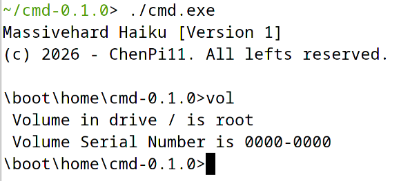
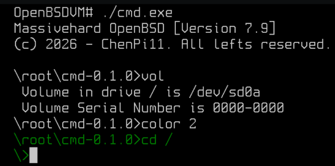
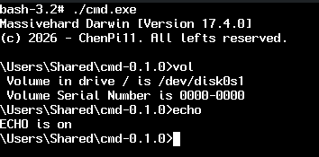
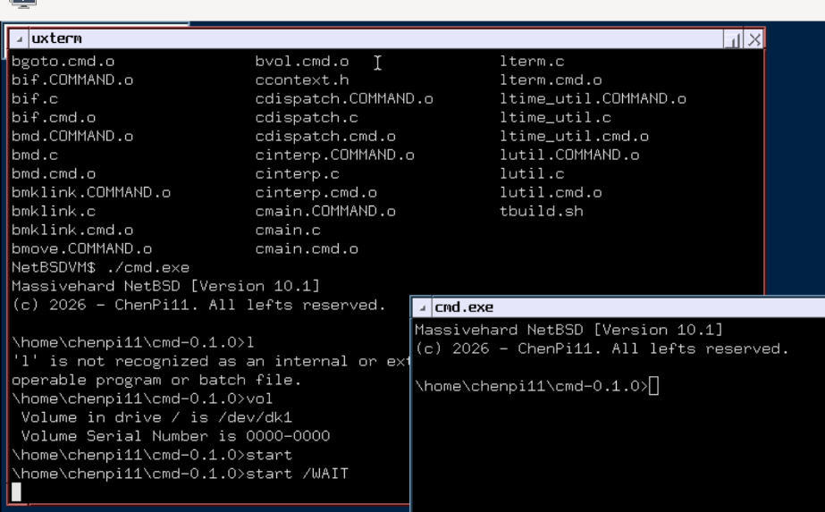
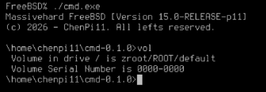
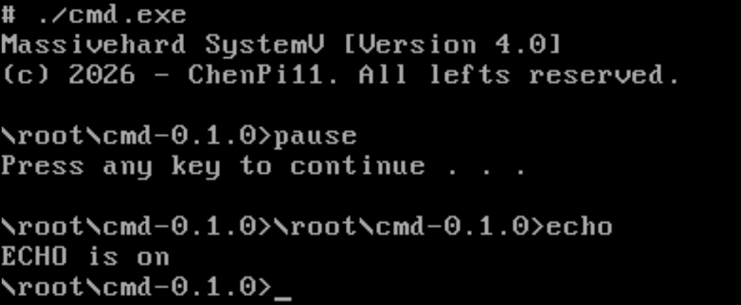
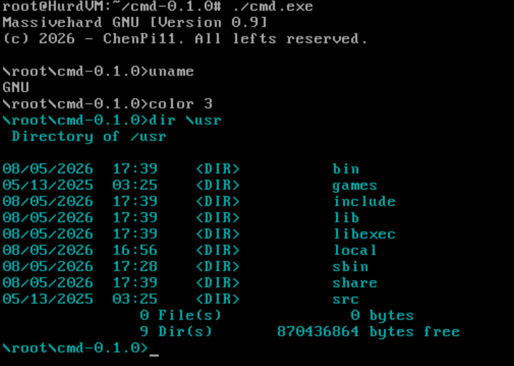
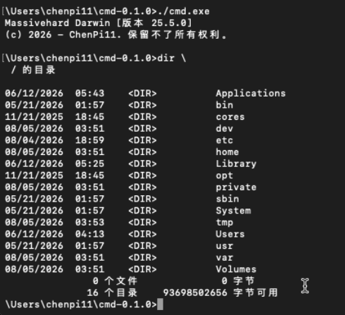

# cmd

> cmd.exe, the command interpreter for Windows, one of the most widely used
> command-line shells in the world.
>
> But it is not available on Unix-like systems. Why not bring it to Unix to
> expand the market?
>
> -- ChenPi11

**A faithful reimplementation of the Windows `cmd.exe` command interpreter for Unix.**

Born on GNU/Linux, runs on **EVERY UNIX-LIKE SYSTEMS**

Unfortunately, it does not support Windows and cannot capture the Windows market.

**ONLY LIBC and POSIX API required.**

**[README: American English](README.md)** |
**[README: 简体中文](README.zh_CN.md)** |
**[README: 微软式中文](README.zh_MS.md)** |
**[README: 八股文](README.zh_WY.md)**

## Supported languages

- American English (en_US.UTF-8, default)
- Simplified Chinese (zh_CN.UTF-8)
- Microsoft translated Chinese (zh_MS.UTF-8)
- Classical Chinese (zh_WY.UTF-8)

By setting the `LANG`, `LC_MESSAGES`, or `LC_ALL` environment variable, you
can change the language of the `cmd` shell.

## Screenshots

`cmd` has been verified running on a wide range of operating systems —
even classic System V.

<table>
  <tr>
    <td align="center">
      
      <br/><sub><b>Haiku</b></sub>
    </td>
    <td align="center">
      
      <br/><sub><b>OpenBSD</b></sub>
    </td>
    <td align="center">
      
      <br/><sub><b>PureDarwin</b></sub>
    </td>
  </tr>
  <tr>
    <td align="center">
      
      <br/><sub><b>NetBSD</b></sub>
    </td>
    <td align="center">
      
      <br/><sub><b>FreeBSD</b></sub>
    </td>
    <td align="center">
      
      <br/><sub><b>System V</b></sub>
    </td>
  </tr>
  <tr>
    <td align="center">
      
      <br/><sub><b>GNU/Hurd</b></sub>
    </td>
    <td align="center">
      
      <br/><sub><b>macOS</b></sub>
    </td>
  </tr>
</table>

## Features

- **Batch scripting** — `CALL`, `GOTO`, `IF`, `FOR`, `SHIFT`,
  `%0`..`%9` expansion, `SETLOCAL`/`ENDLOCAL` scoping, and labels.
- **Full pipe & redirection support** — `|`, `<`, `>`, `>>`, `2>` with
  `cmd.exe` precedence rules.
- **40+ builtin commands** — `ASSOC`, `COPY`, `DIR`, `ECHO`, `FOR`, `IF`,
  `SET`, `START`, `TITLE`, `TYPE`, and more.
- **Windows-style environment semantics** — case-insensitive `%VAR%`
  expansion, `%CD%`, `%DATE%`, `%TIME%`, `%ERRORLEVEL%`, `%CMDCMDLINE%`,
  delayed expansion with `/v:on`.
- **Line editing** — bundled linenoise with Emacs bindings, persistent
  history (`~/.cmd_history`), and TAB file/directory completion.
- **AutoRun support** — site-wide/user init scripts from
  `$PREFIX/etc/cmd/AutoRun/`, plus `AUTOEXEC.BAT` for `COMMAND.COM`.
- **Localised UI** — English and Simplified Chinese, selected from the
  `LC_ALL` / `LC_MESSAGES` / `LANG` environment.
- **Two personalities** — `cmd.exe` for the standard interpreter and
  `COMMAND.COM` with classic MS-DOS AutoExec behaviour.
- **No external dependencies** — C89, a POSIX.1 libc, and nothing else.

## Building

### GNU/Linux (GNU Make)

```sh
make
make install PREFIX=/usr/local
```

### Generic Unix (including System V)

```sh
sh tbuild.sh                 # uses $CC, defaults to cc.
sh tbuild.sh CC=cc V=0       # quiet build with a specific compiler.
env SYSV=0 ./tbuild.sh       # Disable System V portability flags.
```

The source is STD C89 with no dependencies beyond a POSIX.1-1990 libc. On
`tbuild.sh` adds the portability flags (`-DLIBCMD_SYSV=1` and
`-DLIBCMD_NO_VSNPRINTF=1`) — see `lsysport.c`.
Use SYSV=0 can disable `-DLIBCMD_SYSV=1`.

## Usage

```text
cmd [/c|/k] [/s] [/q] [/d] [/a|/u] [/t:{bf|f}]
    [/e:{on|off}] [/f:{on|off}] [/v:{on|off}] [string]
```

| Option | Description |
| :--- | :--- |
| `/c string` | Execute `string` and exit |
| `/k string` | Execute `string` and remain interactive |
| `/s` | Special parsing mode for `/c`/`/k` (strip outer quotes) |
| `/q` | Quiet mode; no banner or prompt |
| `/d` | Disable AutoRun scripts |
| `/a` | ANSI output (default) |
| `/u` | Unicode output |
| `/t:{bf\|f}` | Set foreground/background colour nibbles, e.g. `/t:0f` |
| `/e:{on\|off}` | Enable/disable command extensions |
| `/f:{on\|off}` | Enable/disable file-name completion |
| `/v:{on\|off}` | Enable/disable delayed expansion |

## Builtin Commands

```text
ASSOC        BREAK        CALL         CD / CHDIR   CLS
COLOR        COPY         DATE         DEL / ERASE  DIR
DOSKEY       ECHO         ENDLOCAL     EXIT         FOR
FTYPE        GOTO         IF           MD / MKDIR   MKLINK
MOVE         PATH         PAUSE        POPD         PROMPT
PUSHD        RD / RMDIR   REM          REN / RENAME SET
SETLOCAL     SHIFT        START        TIME         TITLE
TYPE         VER          VERIFY       VOL
```

## Batch Files

Batch files (`.bat` and `.cmd`) are fully supported, including `CALL`,
`GOTO`, `IF`, `FOR`, `SHIFT`, `%0`..`%9` argument expansion, and
`SETLOCAL`/`ENDLOCAL` scoping. Labels use the colon prefix:

```bat
@ECHO OFF
:again
ECHO Hello, %1
SHIFT
IF NOT "%~1"=="" GOTO again
```

## Pipes and Redirection

```text
|          Pipe stdout of the left command to stdin of the right
< file     Redirect stdin from file
> file     Redirect stdout to file (overwrite)
>> file    Redirect stdout to file (append)
2> file    Redirect stderr to file
```

Multiple redirections can be combined on a single command line.

## Files

| Path | Purpose |
| :--- | :--- |
| `~/.cmd_history` | Command history (plain text, one command per line) |
| `~/.cmd_assoc` | File extension associations (`ASSOC` / `FTYPE`) |
| `$PREFIX/etc/cmd/AutoRun/` | Scripts executed on startup |
| `AUTOEXEC.BAT` | Startup script for `COMMAND.COM` |

## Portability

`cmd` avoids GNU extensions, designated initialisers, and C99 types where
possible. Systems without `fnmatch(3)`, `settimeofday(2)`,
`setpriority(2)`, or `open_memstream(3)` are covered by the portability
layer in `lsysport.c`.

## License

GNU General Public License **version 3 or later** — see [LICENSE](LICENSE).

## Contributing

See [CONTRIBUTING](CONTRIBUTING).
